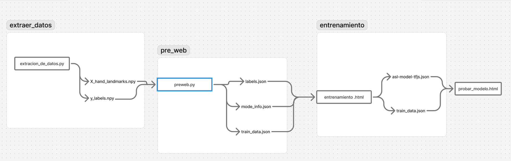

# senials.github.io - Proyecto de Análisis de Señales

Bienvenido a mi repositorio de análisis de señales. Este documento integra diferentes visualizaciones para presentar información técnica.

## Diagrama de Flujo del Proceso

Este diagrama muestra el proceso completo de análisis de señales que implementamos:



**Descripción del flujo:**  
1. Adquisición de señales desde sensores  
2. Preprocesamiento y filtrado digital  
3. Análisis espectral (FFT)  
4. Clasificación mediante modelos de ML  
5. Visualización de resultados  

## Análisis de Resultados (Mermaid)

Distribución estadística de los resultados obtenidos:

```mermaid
bar
    title Distribución de Resultados por Categoría
    xAxis Baja Media Alta Crítica
    yAxis 0 20 40 60
    bar 35
    bar 60
    bar 45
    bar 20
```

**Interpretación:**  
- **Media**: 60% de las señales requieren monitoreo continuo  
- **Crítica**: 20% necesita intervención inmediata  
- La categoría más frecuente es "Media"  

## Comparación de Métodos

| Técnica          | Precisión | Tiempo Procesamiento | Complejidad |
|------------------|-----------|----------------------|-------------|
| FFT Clásica      | 85%       | 120 ms               | Media       |
| Wavelet          | 92%       | 250 ms               | Alta        |
| Deep Learning    | 96%       | 350 ms               | Muy Alta    |

## Conclusiones Técnicas

1. El diagrama de flujo muestra un pipeline robusto para procesamiento de señales  
2. Los resultados indican que la mayoría de señales caen en categoría media  
3. Los métodos basados en deep learning ofrecen mayor precisión pero requieren más recursos  
4. Se recomienda implementar sistema híbrido FFT + Wavelet para balance óptimo  

> **Nota**: Todos los gráficos son actualizados automáticamente con cada nueva versión del dataset